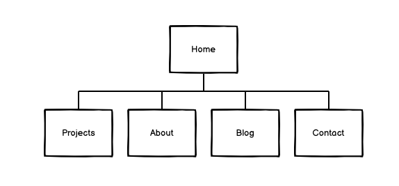
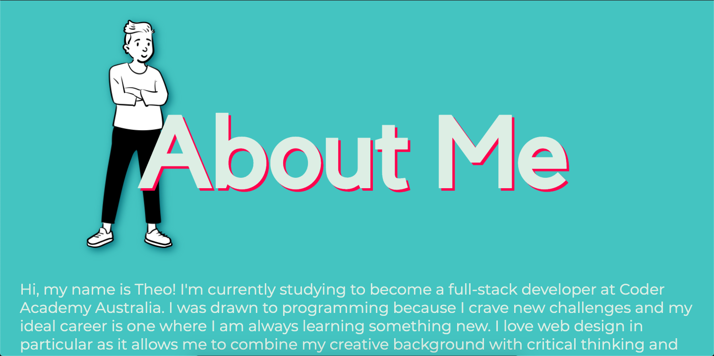
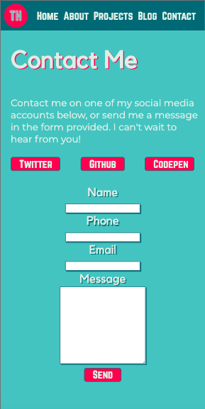
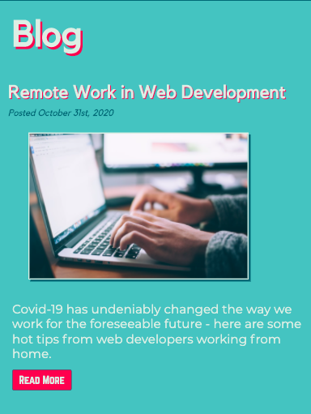

# Theo's Portfolio

## Links

**GitHub Repository:** https://github.com/Theosaurus-Rex/coder-portfolio

**Live Website:** https://reverent-villani-122a74.netlify.app/

## Purpose
The purpose of this portfolio is to showcase my skills and personality to potential employers. It not only serves as a directory for projects I've worked on but also shows my skills in developing websites through the content of the portfolio itself. Additionally, it is a platform that potential employers and clients can contact me through.

## Features & Functionality
This website is optimised for viewing on mobile, tablet, and desktop displays, aiming to be accessible to the widest audience possible. It features a simple navigation menu with clear links to avoid confusion, which additionally will scale to the viewing device to be as functional as possible. Care has been taken to ensure that all text is readable, and semantic HTML has been used where appropriate to allow for ease of access by screen readers and other assistance devices. 

Note that some features differ from the initial wireframe:
- Removed social icons from nav bar to reduce clutter
- Layout of main page headings and graphics differs slightly purely due to aesthetic appeal
- Short descriptions added to each project on "Projects" page for clarity

## Sitemap

## Screenshots

## Target Audience
This site is aimed at two primary audiences. The first group is made up of those who are seeking developers for their business or startup, and serves as a way of showcasing skills they may specifically be looking for to fill the role they need. The second, and perhaps less prominent audience, is individuals who are looking to contract a developer as a freelancer to work on a single project, such as a website.

## Tech Stack
The following tech was used in the production of this portfolio:
- HTML
- CSS
- Git/Github
- Netlify (Deployment)
- Inkscape (Image Editing)

## Other Resources
The following external resources were used in creating this website:
- Google Fonts
- Unsplash (for stock images)
- OpenPeeps (for cartoon portraits)

